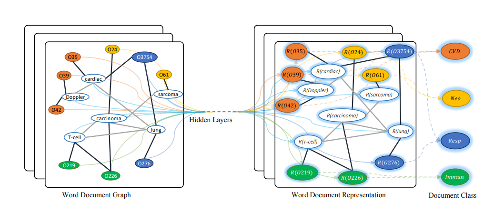

## Text-GCN 
[](https://paperswithcode.com/sota/text-classification-on-r8?p=graph-convolutional-networks-for-text)
[](https://codebeat.co/projects/github-com-codekgu-text-gcn-master)

A PyTorch implementation of "Graph Convolutional Networks for Text Classification." (AAAI 2019)



For an introduction to the paper check out my [blog post](https://kenqgu.com/text-classification-with-graph-convolutional-networks/).
Also checkout my [blog post](https://kenqgu.com/classifying-asian-prejudice-in-tweets-during-covid-19-using-graph-convolutional-networks/) about using Text GCN to classify tweets for asian prejudice during COVID-19. 
### Abstract

Text classification is an important and classical problem in natural language processing. There have been a number of studies that applied convolutional neural networks (convolution on regular grid, e.g., sequence) to classification. However, only a limited number of studies have explored the more flexible graph convolutional neural networks (convolution on non-grid, e.g., arbitrary graph) for the task. In this work, we propose to use graph convolutional networks for text classification. We build a single text graph for a corpus based on word co-occurrence and document word relations, then learn a Text Graph Convolutional Network (Text GCN) for the corpus. Our Text GCN is initialized with one-hot representation for word and document, it then jointly learns the embeddings for both words and documents, as supervised by the known class labels for documents. Our experimental results on multiple benchmark datasets demonstrate that a vanilla Text GCN without any external word embeddings or knowledge outperforms state-of-the-art methods for text classification. On the other hand, Text GCN also learns predictive word and document embeddings. In addition, experimental results show that the improvement of Text GCN over state-of-the-art comparison methods become more prominent as we lower the percentage of training data, suggesting the robustness of Text GCN to less training data in text classification.

This repository contains a PyTorch implementation of 
> Graph Convolutional Networks for Text Classification. 
> Liang Yao, Chengsheng Mao, Yuan Luo.
> AAAI, 2019. [\[Paper\]](https://arxiv.org/abs/1809.05679)

A reference Tensorflow implementation is accessible [\[here\]](https://github.com/yao8839836/text_gcn).

### Requirements
This repo uses python 3.6 and the following PyTorch packages:

- torch==1.3.1
- torch-cluster==1.2.4
- torch-geometric==1.1.2
- torch-scatter==1.1.2
- torch-sparse==0.4.0
- torchvision==0.4.0

I also use [comet.ml](https://www.comet.ml/site/) for experiment tracking

### Included Datasets
The included datasets are a twitter asian prejudice [dataset](https://arxiv.org/abs/2005.03909), reuters 8, and AG's news topic classification [dataset](https://github.com/mhjabreel/CharCnn_Keras/tree/master/data/ag_news_csv).

For a new dataset, prepare a `[dataset_name]_labels.txt` and `[dataset_name]_sentences.txt` in `/data/corpus` in which each line corresponds to a document and its corresponding label. 
Use `prep_data.py` to further clean `[dataset_name]_sentences.txt`.
The script will generate a  `[dataset_name]_sentences_clean.txt`
 
The following is an example of the constructed text graph for the twitter dataset. Green represents text nodes and red represents document nodes.


### Running the model
To run the model simply change the model and dataset configurations in `config.py`. You can also enter your own cometml information to see the results and experiment running in the browser. 
After model configuration, simply run 
```
$ python main.py
```

### Results
Some initial results I have obtained using hyperparameters from the TextGCN paper are

Dataset | F1-Weighted | Accuracy
--------|-------------|---------
twitter_asian_prejudice | 	0.723 | 0.754
r8_presplit | 0.962 | 0.963
ag_presplit | 0.907 | 0.907

Try playing around with the hyperparameters or include your own dataset!
